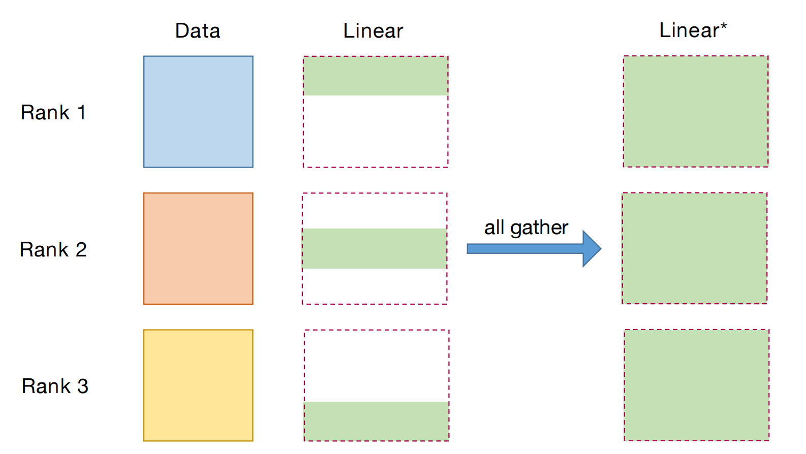
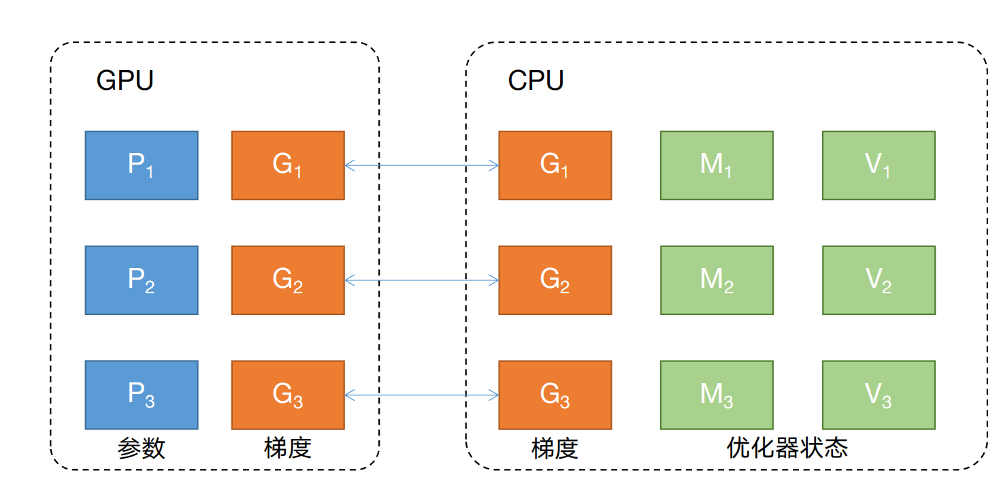

- [核心技术简介](#核心技术简介)
  - [大模型性能瓶颈](#大模型性能瓶颈)
  - [ZeRO 3 优化](#zero-3-优化)
  - [通信运算重叠](#通信运算重叠)
  - [CPU Offload](#cpu-offload)
- [使用方法](#使用方法)
  - [1. 安装](#1-安装)
  - [2. 引入bmtrain并初始化](#2-引入bmtrain并初始化)
  - [3. 启用ZeRO-3优化](#3-启用zero-3优化)
  - [4. 启用通信优化](#4-启用通信优化)
  - [5. 启用训练任务](#5-启用训练任务)


# 核心技术简介 

## 大模型性能瓶颈
- 算力
  - GPU运算效率
    - Tensor Core
    - FP16
  - CPU运算效率
    - `AVX512 / AVX512` 指令集
    - 核心数
- 通信
  - GPU-GPU间通信
    - nvlink
    - infiniband 
  - GPU-CPU 间通信
    - PCI-E 带宽
    - pinned-memory 大小限制


## ZeRO 3 优化



## 通信运算重叠


## CPU Offload



# 使用方法


## 1. 安装


推荐配置
-  GPU间通信带宽: `100Gbps` 
-  GPU间通信带宽: `PCI-E 3.0x16`
- GPU型号要求: `pytorch V100 32GB`  
- 内存大小: `32~64GB/GPU`  
- CPU核心数: `4~8 vCPU / GPU (AVX512)`  

 
编译源代码安装
```python
python3 setup.py install 
```
编译依赖
- `C++ 11` 
- `nvcc`  
- `pytorch >= 1.10`  
- `python 3`  

编译开关
-  `BMT_AVX256=1` 强制使用AVX指令集 
-  `BMT_AVX512=1` 强制使用AVX512指令集 
 
## 2. 引入bmtrain并初始化

```python
import bmtrain as bmt 
bmt.init_distributed(
    seed = 0
    #... 
)
```
在代码开头引入 `bmtrain`, 并使用 `init_distributed`方法进行初始化。示例如上。

## 3. 启用ZeRO-3优化 
对原始代码进行简单替换操作 (以 `pytorch` 为例):
-  `torch.nn.Module` ->  `bmtrain.DistributedModule` 
-  `torch.nn.Parameter` ->  `bmtrain.DistributedParameter` 


然后在合适的模块上使用 `Checkpointing`

## 4. 启用通信优化 
对原始代码进行简单替换操作 (以 `pytorch` 为例):
-  `torch.nn.ModuleList` ->  `bmtrain.TransformerBlockList` 
-  `x=module(x,...)` ->  `x=module_list(x,...)` 


## 5. 启用训练任务

-  `torch.distributed.launch`
-  `torchrun`
